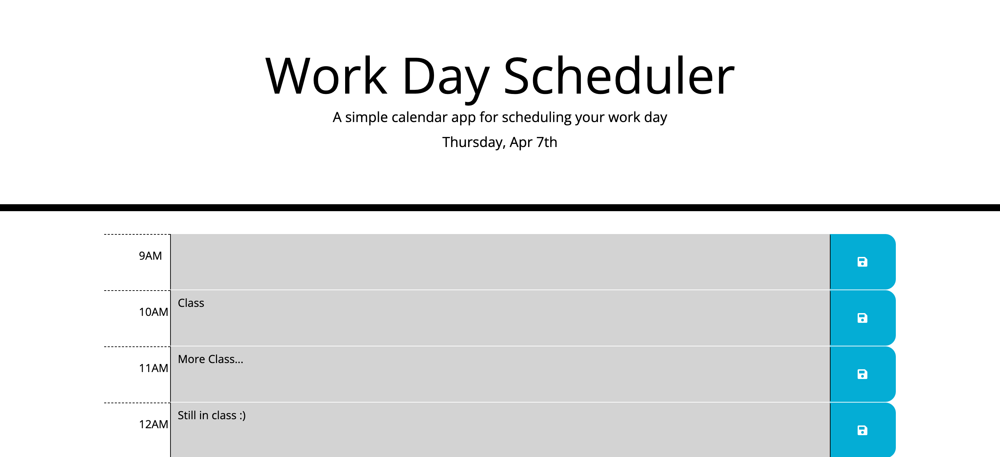

# HMWK5 - (05 Third-Party APIs: Work Day Scheduler)

## Description

This is a simple calendar application that allows users to save daily events for each hour. This app runs in the browser and features dynamically updated HTML and CSS powered by jQuery. I utilized Moment.js while working with the date and time and local storage for persistence. It also has a clean and polished, responsive user interface that adapts to multiple screen sizes.

## Mock-Up

The following image shows the web application's appearance:

## Link

[Live site](https://brianbixby.github.io/hmwk5/)

## Technology

- [HTML](https://developer.mozilla.org/en-US/docs/Web/HTML)
- [CSS](https://developer.mozilla.org/en-US/docs/Web/CSS)
- [Github](https://github.com/brianbixby/hmwk5)
- [Javascript](https://developer.mozilla.org/en-US/docs/Web/javascript)
- [Local Storage](https://developer.mozilla.org/en-US/docs/Web/API/Window/localStorage)
- [Moment.js](https://momentjs.com/)
- [jQuery](https://jquery.com/)
